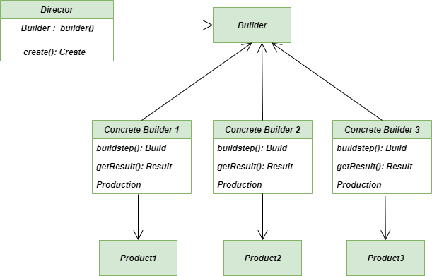
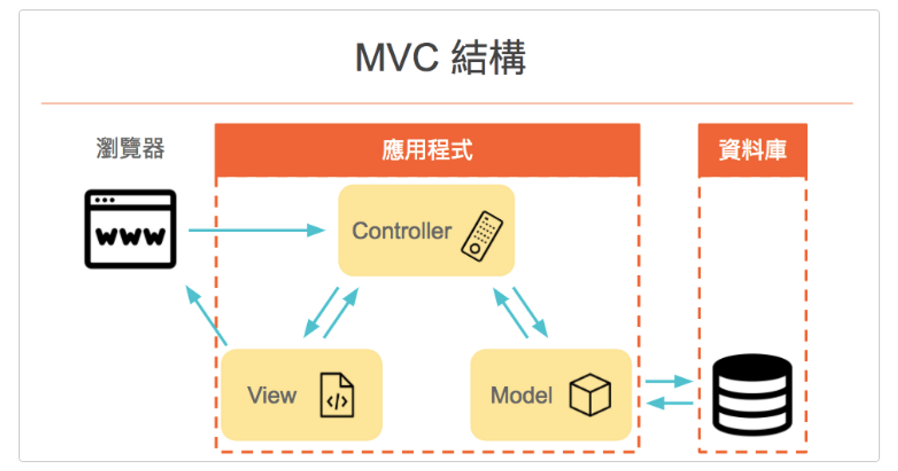
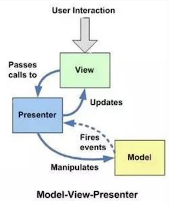

# Design Pattern
[中文版](README.zh-TW.md) | [English](README.md)

* 设计模式是一套被反复使用、多数人知晓的、经过分类编目的、代码设计经验的总结。
* 使用设计模式是为了可重用代码、让代码更容易地被他人理解、保证代码可靠性。
* 接口=介面、對象=物件
* 預先認知: 物件導向、類別與物件、可變與不可變物件、Pass by Assignment、Decorator。[參考Notion]()


* 大綱:
    * 基礎提要
        * [物件導向與設計模式概要](#introduction)
            * [物件導向概要](#intro-oop)
            * [設計模式概要](#intro-design-pattern)
        * [繼承]()
        * [抽象類別、介面](#abstractorinterface)
        * [多型]()
        * [封裝](#encapsulation)
    * [23 種設計模式](https://jasonblog.github.io/note/design_pattern/index.html)
       :heavy_check_mark:常用
        * **創建型模式**
            * [Singleton](#singleton)
            * [Abstract Factory](#)
            * [Builder](#)
            * [Factory Method](#)
            * [Prototype](#)
        * **結構型模式**
            * [Adapter](#):heavy_check_mark:
            * [Bridge](#)
            * [Composite](#)
            * [Decorator](#decorator):heavy_check_mark:
            * [Facade](#)
            * [Flyweight](#)
            * [Proxy](#)
        * **行為模式**
            * [Template Method](#)
            * [Command](#):heavy_check_mark:
            * [Interpreter](#)
            * [Mediator](#)
            * [Iterator](#)
            * [Observer](#)
            * [Chain Of Responsibility](#)
            * [Memento](#)
            * [State](#)
            * [Strategy](#strategy):heavy_check_mark:
            * [Visitor](#)
    * 特殊設計
        * [MVC (由Observer, Strategy, Composite演變)](#mvc):heavy_check_mark:
        * [MVP](#mvp):heavy_check_mark:
        * [MVVM](#mvvm):heavy_check_mark:
    * [參考](#reference)


## Introduction

#### Intro-OOP

基本原則 (1~5又稱SOLID)

* **單一職責原則 (SRP：Single Responsibility Principle)** 一個類別，應該只有一個引起它變化的原因
* **開放、封閉原則 (OCP：Open Closed Principle)** 對於擴展是開放的 (open for extension) 對於修改是封閉的 (closed for modification)
* **里氏(Liskov)代換原則 (LSP：Liskov Substitution Principle)** 子類別必須能替換父類別。
* **介面隔離原則 (ISP：Interface Segregation Principle)**
* **依賴倒轉原則 (DIP：Dependency Inversion Principle)** 抽象不應該依賴細節，細節應該依賴抽像。因為抽像相對較穩定。 高層模組不應該依賴低層模組，兩個都應該依賴抽像。 針對接口編寫程式，不要對具體實現的東西編寫程式。
* **迪米特法則 (LoD：Law of Demeter)** 最少知識原則 Principle of Least Knowledge 只和自己眼前的朋友交談 Only talk to your immediate friends 低耦合

    例如: 郵差送來掛號信，須要蓋收件人印章。 一般人不會叫郵差自己進屋找印章，既浪費時間也不安全。 正常都是自己進屋拿，或是請其他家人幫忙拿。 因為不應該給郵差進屋找東西的權限、郵差也不須要知道印章放在屋內何處。
* **合成/聚合重覆使用原則 (CARP)(Composite/Aggregate Reuse Principle)** 多用合成/聚合，少用繼承。 在兩個物件有 has-a (has-parts、is-part-of)關係時 => 合成/聚合 (A has a B) 當兩個物件有 is-a (is-a-kind-of)關係時 => 繼承 (Superman is a kind of Person)
    * 合成 (Composite)：A、B兩物件有合成關係時，表示其中一個物件消失(ex:書本)，另一個物件也會消失(ex:章節)。
    * 聚合 (Aggregate)：A、B兩物件有聚合關係時，表示其中一個物件消失(ex:球隊)，另一個物件不會消失(ex:球員)。

<a href="#top">Back to top</a>

#### Intro-Design Pattern

* 創建型模式 (Creational Pattern)
    * **簡單工廠模式 (Simple Factory pattern)** 使用 class 的靜態方法，依不同條件，取得不同物件，並用取得的物件，做類似的事情。 缺點是要新增不同條件時，須修改到類別的靜態方法。
    * **工廠方法模式 (Factory Method Pattern)** 避免了簡單工廠模式，要新增條件時，對工廠類靜態方法的修改(對修改應該是封閉的)。
    * **抽象工廠模式 (Abstract Factory Pattern)** 抽象工廠類別，可返回同類型的工廠。這些返回的工廠，有多個相同的方法，做類似的事。
    * **建造者模式(生成器模式) (Builder Pattern)** 將某種類的產品建造過程，將生產步驟整理出來， 所有要生產這類產品的 class，均要實現這些標準化步驟。 另外，為避免實際生產時，遺漏某步驟，統一由一個指揮者 class，執行一系列的生產步驟。
    * **原型模式 (Prototype Pattern)** 複製一個已存在的物件，來產生新的物件。 淺複製(shallow clone)：僅複製舊物件內的屬性，舊物件內的物件不複製。所以新、舊物件會共用這些其他物件。 深複製(deep clone)：舊物件內的屬性、參考到的其他物件，都會複製一份。
    * **單例模式 (Singleton Pattern)** 讓一個類別只能有一個實例(Instance)的方法。 產生單一實例的方式： 懶漢方式(Lazy initialization)：第一次使用時，才產生實例。 餓漢方式(Eager initialization)：class 載入時就產生實例，不管後面會不會用到。

* 結構型模式 (Structural Pattern)
    * **適配器模式 (Adapter Pattern)** 某個已存在的類，介面不是用戶所期待的。適配器，則是當做中間的轉接口，以提供用戶期待的介面。 可分成兩種實作方法 Object Adapter Pattern (對象適配器模式)：將已存在的類的實例，包裹在適配器類別中。 Class Adapter Pattern (類適配器模式)：使用多重繼承。
    * **橋接模式 (Bridge Pattern)** 將一個物件的具體行為(實作)抽出來，成為一個獨立的物件。 也就是原本的一個物件，變成兩個物件：「抽像物件」+「實作物件」。 優點是抽像物件與實作物件可以解耦合，各自獨立變化。
    * **組合模式 (Composite Pattern)** 數個物件之間，呈現一種樹狀結構。
    * **裝飾模式 (Decorator Pattern)** 在某一物件動態加上功能。 一層一層的將功能套上去，每一層執行的是不同的物件。
    * **外觀模式 (Facade Pattern)** 將原有的大系統包裝起來，用另一個較簡易的介面開放給使用者。 使用者只須瞭解介面的的使用方式。而不須瞭解大系統內，各個小系統的操作方式。
    * **享元模式 (Flyweight Pattern)** 物件之間，若有共同的部分可以共享，則將可共用的部分獨立為共享物件， 不能共享的部份外部化，使用時再將外部化的部分傳給共享物件。 這樣做的優點是減少記憶體使用量。缺點是程式邏輯可能變得較複雜。
    * **代理模式 (Proxy Pattern)** 有兩個物件，代理物件、真實物件， 系統使用代理物件操作，代理物件內部則再去操作真實物件。 應用：遠程代理、虛擬代理、安全代理

* 行為型模式 (Behavioral pattern)
    * **責任鏈模式 (Chain-of-responsibility Pattern)** 有幾個物件都能處理某種請求，但處理的能範圍(權限)不同， 當這個物件沒有處理的權限時，能夠將這個請求，傳遞給下一個物件繼續處理。
    * **命令模式 (Command Pattern)** 一般命令包含發出命令和執行命令。 命令模式，則是將這個過程拆成三個物件，發出命令的物件(Invoker)、命令的物件(command)、執行命令的物件(receiver) 由 Invoker 物件，來建造要執行的命令。如此要擴充功能時，例如增加命令重覆執行、取消命令...等，也變得較單純。
    * **解釋器模式 (Interpreter Pattern)** 用來解釋、直譯一種語言的方法。
    * **迭代器模式 (Iterator Pattern)** 遍歷容器裡面元素的一種方法。
    * **中介者模式 (Mediator Pattern)** 當物件和物件之間或有錯綜複雜的交互作用，可將這些關係交由另一物件(中介者)來處理， 以減少這些物件間的耦合。
    * **備忘錄模式 (Memento Pattern)** 讓物件回復到之前狀態的方法。
    * **觀察者模式 (發佈/訂閱模式) (Observer Pattern)** 兩種類型的物件，「通知者」和「觀察者」。
        * 訂閱：「通知者」可增減訂閱列表中的「觀察者」
        * 發佈：當有監聽的事件發生時，「通知者」可從訂閱列表中，將事件通知「觀察者」，「觀察者」則會對此事件做相對應的動作。
        * 功用：解除耦合，讓耦合的雙方依賴抽像(接口)，而不依賴具體。
    * **狀態模式 (State Pattern)** 一物件有多個狀態，在不同狀態下有不同的行為。 一般可能會用多個 if else 來處理這些分支行為。 若使用狀態模式，則是將這些狀態處理，提取出來到另外的 class 處理這些分支。 也就是將 if else 改寫成 class。
    * **策略模式 (Strategy Pattern)** 將不同的演算法，定義成一個家族， 這些演算法實現同樣的接口，且寫成個別的類別，所以彼此之間能夠互相替換。 優點是以後要增加新的演算法，只須額外新增一個類別，不須動到原本的類別。
    * **模板方法模式 (Template Method Pattern)** 將不變的部分移到父類別，去除子類別重覆的程式碼
    * **訪問者模式 (Visitor Pattern)** 當一個「物件結構」中的「元素」幾乎不會異動，但這些「元素的行為」常會增減，則適合用訪問者模式。 訪問者模式是將「元素的行為」，提取出來，每一種行為做成一個 「Visitor(訪問者) 物件」， 每一個 「Visitor(訪問者) 物件」，都能根據原本「物件結構」中不同的「元素」，產生不同行為。

<a href="#top">Back to top</a>

## Abstractor、Interface

python相比java，java嚴格區分了抽象以及介面。python沒有原生的抽象類別和方法，必須使用abc package實作抽象類別、介面。在Python不管是抽象類別還是介面都是繼承abc.ABC。
(`C:\Users\junxianglin\AppData\Local\Programs\Python\Python38\lib\abc.py`)

* **抽象類別(abstractor)**
    * 類別的抽象化
    * **無法實體化的類別**
    * 當有方法(Method)套上`@abc.abstractmethod`裝飾器(decorator)時，表示建立抽象方法，必須依靠子類別覆寫。

        ```python
        from abc import ABC, abstractmethod
        class Animal(ABC): # python 中繼承 abc.ABC，表示該類別為抽象類別，不可直接實體化
            def __init__(self, name="john", shout_num=1):
                self.name = name
                self.shout_num = shout_num
            def run(self):
                """ implement run behavior"""
                print('run')
            @abstractmethod
            def shout(self): # 套上抽象類別修飾器，該方法為抽象方法，不可直接實體化，僅定義方法，實際內容由子類別覆寫
                pass
            
        class Dog(Animal):
            def __init__(self, name, shout_num):
                super().__init__(name, shout_num)
            def shout(self):
                print('wo' * self.shout_num)
        class Cat(Aniamal):
        ...
        dog = Dog('daniel', 3)
        dog.run() # run
        dog.shout() # wowowo
        animal = Animal() # TypeError: Can't instantiate abstract class Animal with abstract methods shout
        ```

* **介面/接口(Interface)**
    * 行為的抽象化
    * **讓外部可以透過這個接口與內部作溝通**
    * 「接口」通常都是有著某些特定形態的，只有收發雙方都有一樣的「接口」，接口才能被有效使用

* 抽象基底類別(abstractor basic class, abc)
    假設我們要開發一個數據接口，具備三個功能: 連接數據庫、讀取數據、執行SQL，可以先透過ABC定義這些功能，再由子類別負責實現(覆寫)
    ```python
    from abc import ABC
    from abc import abstractmethod
    ​
    ​
    class Database(ABC):
        def register(self, host, user, password): # register是每個子類都需要的，直接實現在abc裡面
            print("Host : {}".format(host))
            print("User : {}".format(user))
            print("Password : {}".format(password))
            print("Register Success!")
    ​
        @abstractmethod
        def query(self, *args):
            """
            传入查询数据的SQL语句并执行
            """
    ​
        @staticmethod
        @abstractmethod
        def execute(sql_string):
            """
            sql...
            """

    class Component1(Database):
        def __init__(self, host, user, password):
            self.register(host, user, password)

        @staticmethod
        def execute(sql_string):
            print(sql_string)

        def query(self, *args):
            sql_string = "SELECT ID FROM db_name"
            self.execute(sql_string)


    class Component2(Database):
        def __init__(self, host, user, password):
            self.register(host, user, password)
    
        @staticmethod
        def execute(sql_string):
            print(sql_string)
    
        def query(self, *args):
            sql_string = "SELECT NAME FROM db_name"
            self.execute(sql_string)

    comp1 = Component1("00.00.00.00", "abc", "000000")
    comp2 = Component2("11.11.11.11", "ABC", "111111")
    comp1.query()
    comp2.query()
    ```


<a href="#top">Back to top</a>

## Encapsulation

* 封裝的目的是不希望外部有任何機會以我們非預期的方式去更改物件，封裝可以強化物件的強健性。
* 在python中有`property`這個decorator可以將方法變成屬性，等於是封裝了這個屬性，外部不需要知道拿到這個屬性的實作方法，並且也不會被任意地更改。

```python
class Product():
    @property
    def price(self):
        return 100
Product().price # 100
Product().price = 150 # AttributeError: can't set attribute

class Product():
    def __init__(self):
        self._price = 100
    @property
    def price(self):
        return self._price
    
    @price.setter
    def price(self, value):
        self._price = value
    
product = Product()
product.price = 150
product.price # 150
```

<a href="#top">Back to top</a>

---

## Singleton

* 單件(Singleton)

<a href="#top">Back to top</a>

## Builder

* 生成器/建造者模式(Builder)
* 使用時機
    * **需要建立的 Product 物件有複雜的內部結構** (多種不同類型的成員屬性、參數)
    * 需要生成的物件屬性相互依賴，需要**指定生成順序**
    * 物件的創建過程獨立於創建物件的類。在建造者模式中通過引入"指揮者類(Director)"，將創建過程獨立封裝在指揮者類中
    * 隔離覆雜物件的創建與使用，併使得相同的創建過程可以創建不同產品

* 缺點
    * 建造者模式所創建的產品一般具有較多共同點，如果產品之間差異很大，則不適合

* 結構
    * Builder: 建造者，用來定義建造物件過程中各必要步驟（方法）的介面。(為ConcrteBuilder的**抽象基底類接口**)
    * ConcreteBuilder: 具體建造者，實作Builder介面，實際用來建造物件的類別
    * Director: 指揮者，負責指揮ConcreteBuilder該如何建造物件。它定義了一個建造產品的**流程**。
    * Product: 產品，Product 是最終建立的產品。

        


    ```python
    from abc import ABC, abstractmethod


    class Product:
        def __init__(self):
            self.part_a = None
            self.part_b = None

        def __str__(self):
            return f"Part A: {self.part_a}, Part B: {self.part_b}"


    class Builder(ABC):
        @abstractmethod
        def build_part_a(self):
            pass

        @abstractmethod
        def build_part_b(self):
            pass

        @abstractmethod
        def get_product(self):
            pass


    class ConcreteBuilder(Builder):
        def __init__(self):
            self.product = Product()

        def build_part_a(self):
            self.product.part_a = "Part A"

        def build_part_b(self):
            self.product.part_b = "Part B"

        def get_product(self):
            return self.product


    class Director:
        def __init__(self, builder):
            self.builder = builder

        def construct(self):
            self.builder.build_part_a()
            self.builder.build_part_b()


    builder = ConcreteBuilder()
    director = Director(builder)

    director.construct()
    product = builder.get_product()
    print(product) # Part A: Part A, Part B: Part B
    ```


<a href="#top">Back to top</a>

## Decorator

* 裝飾器模式(Decorator)
* 關注在"**不修改原物件或function**"的前提下，幫物件動態"**添加新功能**"
* 使用時機: **多個 function 需要做些前置或後置的工作**，可以統一裝修，例如logging驗證
* 功能特點:
    * 不修改已有函數的原始碼
    * 不修改已有函數的呼叫方式
    * 給已有函數增加額外的功能
* 在Python中建置好的新功能，可以透過`＠`對現有物件進行擴充
* 常見的擴充範疇為：**資料驗證(pydantic)**、**Caching**、Logging、Monitoring、**Debugging**、Business Rules、Excryption、Compression…

<details>
<summary>Timeit</summary>

* 不改變原物件 f1
* 在執行f1之前: 記下時間
* 在執行f1之後: 記下時間，併印出f1執行時間
* 符合時機: 多個 function 需要記下執行時間

    ```python
    from functools import wraps
    import time

    def timeit(func):
        @wraps(func)
        def wrapper(*arg, **kwarg):
            time_start = time.time()
            value = func(*arg, **kwarg)
            time_end = time.time()
            time_spend = time_end - time_start

            print(f"[{func.__name__}] function cost time: {time_spend}")

            return value

        return wrapper

    @timeit
    def f1(t):
        time.sleep(t)
        print("End~")

    f1(1)
    f1(2)
    ```
</details>

<details>
<summary>Property</summary>


</details>

<details>
<summary>Cache</summary>

* 透過 cache 機制，記下運算過程，遇到重複過程時可**避免重複運算** (streamlit 在做 load data也可以用`@cache`處理)
* 將經常重複使用的計算結果存放在存取速度較快的記憶體中，加速取得結果的方式。
* 當數據量大時，會遇到內存被占用問題，這是一個雙面刃

* 自定義一個簡單 cache decorator，提升計算費式數列效能。重複的fib(i) 透過cache取得

    ```python
    from functools import wraps 

    def cache(func): 
        caches = {} 
        @wraps(func) 
        def wrap(*args): 
            if args not in caches: 
                caches[args] = func(*args) 
            return caches[args] 
        return wrap 

    @cache 
    def fib(n): 
        if n < 2: 
            return 1 
        return fib(n-1) + fib(n-2)
    ```

* `functools.lru_cache(maxsize)`
    * 基於最少使用(least recently used, LRU)算法實現緩存功能，會自動管理緩存大小(**自動刪除最少使用的**)
    * maxsize 定義只需記下的遞迴深度

        ```python
        from functools import lru_cache

        @lru_cache(maxsize=100)
        def fib(n): 
            if n < 2: 
                return 1 
            return fib(n-1) + fib(n-2)
        ```

    * **適用於任何重複計算的函數**

        ```python
        from functools import lru_cache

        @lru_cache(maxsize=3)
        def add(a, b):
            print("Calculating...")
            return a + b

        print(add(1, 2))  # Calculating... 3
        print(add(1, 2))  # 3 (from cache)
        print(add(3, 4))  # Calculating... 7
        print(add(5, 6))  # Calculating... 11
        print(add(3, 4))  # 7 (from cache)
        ```

    * 修飾"返回可變物件"的函數，需使用拷貝。[參考](https://www.zhihu.com/question/350078061)

        ```python
        from functools import lru_cache
        from copy import deepcopy

        def copying_lru_cache(maxsize=10, typed=False):
            def decorator(f):
                cached_func = lru_cache(maxsize=maxsize, typed=typed)(f)
                def wrapper(*args, **kwargs):
                    return deepcopy(cached_func(*args, **kwargs))
                return wrapper
            return decorator


        @copying_lru_cache()
        def cached_function(param):
            print(f"running cached_function on: {param}")
            return np.array([param])


        for number in [100, 100, 100, 200]:
            res = cached_function(number)
            res *= 5
            print(f"number: {number}, result: {res}")
        ```
</details>

<details>
<summary>Debugging</summary>

* Debug 通常會透過 `print` 來協助，以下函式可以看到，我們會對該物件侵入式修改，最終得移掉print，相當不便

    ```python
    def sum(a, b):
        print("a=", a)
        print("b=", b)
        print("a+b=", a+b)
        return a+b
    ```

* 透過 debug decorator

    ```python
    def sum(a, b):
        return a + b

    def debug(func):
        print('func name: ', func.__name__)
        def wrapper(*args, **kwargs):
            print('args', args)
            print('kwargs', kwargs)
            result = func(*args, **kwargs)
            print(func.__name__, '=', result)
        return wrapper

    debug_sum = debug(sum)
    debug_sum(1, 2)

    """
    func name: sum
    args (1, 2)
    kwargs {}
    sum = 3
    """
    ```

</details>

<details>
<summary>Decorator with parameters</summary>

* 多加一層 decorator
* 限制輸出前 k

    ```python
    from functools import wraps

    def limitOutput(dec_arg=0):
        def callable(func):
            @wraps(func)
            def wrapper(*arg, **kwarg):
                v = func(*arg, **kwarg)

                return v[:dec_arg]
            return wrapper
        return callable

    @limitOutput(10)
    def exec():
        return [i for i in range(100)]

    exec()
    ```

</details>

<details>
<summary>Multi Decorator</summary>

* 多個修飾器的執行順序

    ```python
    @decorator_a
    @decorator_b
    def f(x):
        print('running f.')

    # decorator b running.
    # decorator b finished.
    # decorator a running.
    # decorator a finished.
    ```
</details>

<a href="#top">Back to top</a>

## Strategy

* 策略模式(Strategy)

* 屬於行為模式，將一組**行為轉換為物件**

* 關注在運行時選擇不同的算法或行為，**面對不同情境，需要作出不同行為，即策略**
    * 排序算法有多種，我們可以根據數據大小選擇不同的算法

* 場景: 大數據系統把文件推送過來，根據不同類型採取**不同解析**
    * 非設計模式
        缺點: 代碼臃腫、類型調整時，需要更改到原代碼
        ```python
        if ():
            ...
        elif ():
            ...
        else ():
            ...
        ```
    * 策略模式
        * `ParserStrategy`: 策略的抽象基類，每個具體的解析策略都繼承該類定義的行為`parse`
        * `ParserContext`: 解析的上下文類，根據傳入的數據類型選擇對應的策略
        ```python
        from abc import ABC, abstractmethod

        class ParserStrategy(ABC): # 定義抽象基類，不可實例化
            @abstractmethod
            def parse(self, data):
                pass

        class Type1Parser(ParserStrategy):
            def parse(self, data):
                # 执行 Type1 解析逻辑
                print("Type1 解析")

        class Type2Parser(ParserStrategy):
            def parse(self, data):
                # 执行 Type2 解析逻辑
                print("Type2 解析")

        class ParserContext:
            def __init__(self, strategy):
                self.strategy = strategy

            def set_strategy(self, strategy):
                self.strategy = strategy

            def parse_data(self, data):
                self.strategy.parse(data)

        # 示例用法
        data = get_data_from_big_data_system()  # 从大数据系统获取数据

        # 创建解析策略实例
        type1_parser = Type1Parser()
        type2_parser = Type2Parser()

        # 创建上下文对象并设置默认解析策略
        context = ParserContext(type1_parser)

        # 根据不同类型选择解析策略
        if is_type1_data(data):
            context.set_strategy(type1_parser)
        elif is_type2_data(data):
            context.set_strategy(type2_parser)

        # 解析数据
        context.parse_data(data)
        ```
<details>
<summary>場景: 不同類型的付費</summary>

```python
class ParserStrategy:
    def parse(self, data):
        raise NotImplementedError

class Type1Parser(ParserStrategy):
    def parse(self, data):
        # 执行 Type1 解析逻辑
        print("Type1 解析")

class Type2Parser(ParserStrategy):
    def parse(self, data):
        # 执行 Type2 解析逻辑
        print("Type2 解析")

class ParserContext:
    def __init__(self, strategy):
        self.strategy = strategy

    def set_strategy(self, strategy):
        self.strategy = strategy

    def parse_data(self, data):
        self.strategy.parse(data)

# 示例用法
data = get_data_from_big_data_system()  # 从大数据系统获取数据

# 创建解析策略实例
type1_parser = Type1Parser()
type2_parser = Type2Parser()

# 创建上下文对象并设置默认解析策略
context = ParserContext(type1_parser)

# 根据不同类型选择解析策略
if is_type1_data(data):
    context.set_strategy(type1_parser)
elif is_type2_data(data):
    context.set_strategy(type2_parser)

# 解析数据
context.parse_data(data)
```

</details>

<a href="#top">Back to top</a>

## MVC

* **檔案分離**: 把不同功用的程式碼放在不同的檔案裡

    (三個檔案夾: Model, View, Controller)

* 三個架構
    * Model: 負責和資料庫溝通
    * View: 負責管理畫面的呈現，也就是 HTML 樣板 (template)
    * Controller: 程式邏輯，M與V的橋樑。來自路由的 request 會先被送到 Controller，再由 Controller 通知 Model 調度資料，並且把資料傳遞給 View 來產生樣板 (template)

        

* Router vs Controller

    * Router: 工作分配，將相對應的URI和controller放進routes[]中
    * Controller: 負責工作，執行 M, V 之間溝通

    (開發API時，只需要關注使用 Router，將不同api路由分離)

* 優點
    * 非常的直覺，好懂
    * 使用 Controller 將 Model 和 View 分開來，具有一定程度的解耦合
* 缺點
    * **三者相互依賴**，一但更新了其中一者，另外兩者也必須跟著修改
    * 隨著不斷的開發和添加功能，**Controller 的代碼會越來越臃腫**
    * 難以進行單元測試

<a href="#top">Back to top</a>

## MVP

* 為了改善 MVC 缺點，將Controller換成Presenter
* 和 MVC 不同的是，Model 層拿到數據後，並不直接傳給 View 更新，而是交還給 Presenter，Presenter 再把數據交給 View，並更新畫面。 (從三者相互依賴變成兩者相互依賴)

    

* 優點
    * 從三者相互依賴變成都只依賴 Presenter (要改動的地方變少了)
    * 責任分明，分工明確
    * View 只負責收到使用者回饋後，呼叫 Presenter 拿取數據，並在接收到數據的時候，更新畫面。
    * Model 被動的接收到 Presenter 命令，拿取資料，並回傳給 Presenter。
    * Presenter 透過介面與 View 和 Model 溝通，是 View 和 Model 的唯一連結窗口。
    * 方便進行單元測試　
        
        由於 Presenter 對 View 是透過介面進行操作，在對 Presenter 進行不依賴 UI 環境的單元測試的時候，可以 Mock 一個 View 對象，單元測試的時候就可以完整的測試 Presenter 業務邏輯的正確性。
* 缺點
    * 隨著不斷的開發和添加功能，Presenter 的代碼會越來越臃腫

<a href="#top">Back to top</a>

## MVVM

* 不管是 MVC 還是 MVP，都無法避免 Presenter(Controller) 的代碼會越來越臃腫的問題，如果能達到一樣的效果(外部行為)，程式碼當然是越少越好囉(內部行為)，於是 MVVM 誕生了
* 透過 **ViewModel** 將 V, M 巧妙連接

... 未完

<a href="#top">Back to top</a>


## Reference
[23 種設計模式](https://jasonblog.github.io/note/design_pattern/index.html)
[用 Python 實現設計模式](https://python-web-guide.readthedocs.io/zh/latest/design/design.html)
[Python 常用設計模式](https://refactoringguru.cn/design-patterns/python)
[MVC、MVP、MVVM](https://ithelp.ithome.com.tw/articles/10218263)

<a href="#top">Back to top</a>
